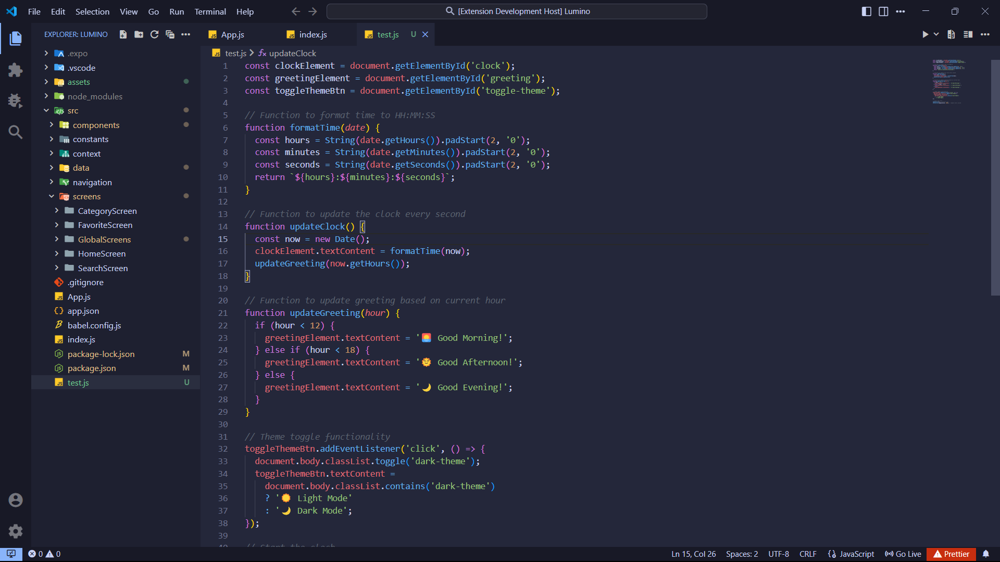
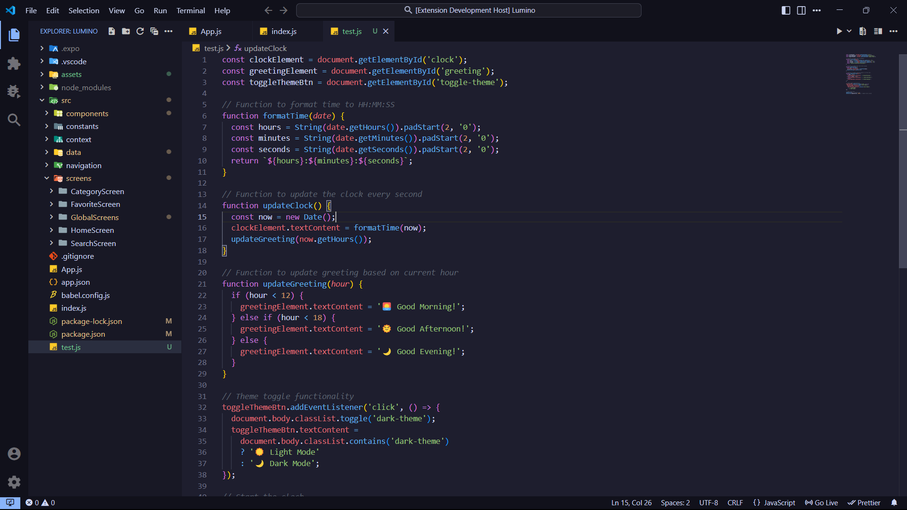

  

<h3 align="center">⭐ Lumino Themes for VS Code</h3>

## 🖼️Previews

A calm dark theme with soothing colors designed for focused, eye-friendly coding sessions.

- ### 🌅Lumino Shadow

  The lightest of the darks — soft and soothing.

  

   
  

- ### 🌇 Lumino Noir

  A medium-dark theme with atmospheric tones.

  

   
  

- ### 🌃 Lumino Obsidian

  The darkest and deepest – perfect for night owls.

  

   
  

## ⚙️ Installation

You can install this theme directly from the VS Code Marketplace:

1. Go to the Extensions view in VS Code.
2. Search for `Lumino Theme`.
3. Click **Install**.
4. Open the Command Palette and select `Preferences: Color Theme` → Choose your favorite Lumino variant.

   - 🌅 Lumino Shadow
   - 🌇 Lumino Noir
   - 🌃 Lumino Obsidian

## Override this theme

To override this (or any other) theme in your personal config file, please follow the guide in the [color theme](https://code.visualstudio.com/api/extension-guides/color-theme) documentation. This is handy for small tweaks to the theme without having to fork and maintain your own theme.

#### 🌠 Created by Avishkar
